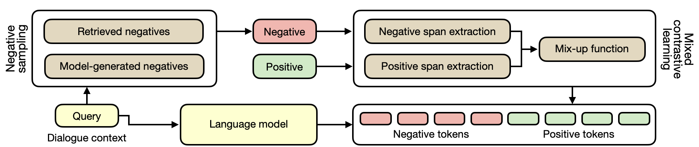

# 对比学习减少会话中的幻觉

代码原论文为[Contrastive Learning Reduces Hallucination in Conversations](https://arxiv.org/abs/2212.10400).

论文提出了MixCL，这是一个对比学习框架，可以用于减少基于LM的知识基础对话系统的幻觉。

## Models

The code for extrating spans is available at `mixup.py`, where we use  [stanza](https://github.com/stanfordnlp/stanza/) and  [spacy](https://github.com/explosion/spaCy) to identify entities and constituencies in text.

The code for model training and testing is available at `run.py`

## Datasets
The dataset (i.e., [Wizard-of-Wikipedia](https://parl.ai/projects/wizard_of_wikipedia/)) is placed in `/dataset`, and `/utils` provides the code for IO and evaluation. 
- Code for dataset pre-processing: https://github.com/sunnweiwei/GenKS/blob/main/process_wizard.py
- Pre-processed datasets are shared at https://drive.google.com/file/d/1ccPi-f8x_yqvVkGVN8rnNkkevrVFyY3D/view?usp=drive_link

## Evaluation
an example of the outputs of models on WoW seen at `outputs_on_seen.txt`

## 复现遇到的问题

- 数据集不全，源论文所提供的数据集中并没有训练所需的'wizard_wiki_full.json', 'train_knowledge_span_new.json', 'train_knowledge_span.json', 和 'train_knowledge_ner.json' 等数据集
- 搜遍全网，包括Hugging Face , ParlAI等等以及运行相关的process_wizard.py源码 (对应dataset文件夹下的data_process.py文件) 也只获得了部分所需数据集如 train.json
- 另外联系作者也未能够及时回复 ，此外源码有个别错误的地方本工程也予以纠正（如run.py中的main函数调用load_wiki函数时传了在其形参中并不存在的title）
- 所收集到的数据集一共7.76GB ,  可通过百度网盘链接进行查看 ：
  - 链接：https://pan.baidu.com/s/1JBKXyZzUlytGo2G1tA6XCQ?pwd=1234 
    提取码：1234
